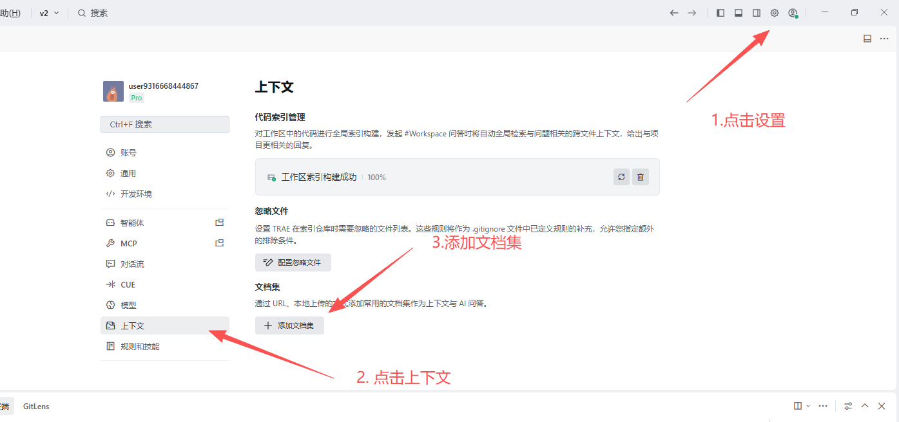
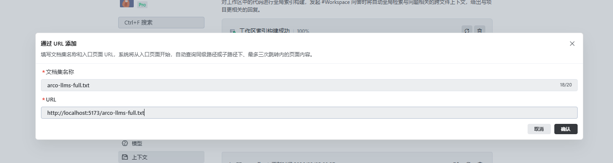

# AI 资源

随着人工智能（AI）技术的发展，AI 辅助编程已成为开发流程中不可或缺的一部分。为了帮助 AI 更好地理解和使用本组件库，我们提供了专为 LLM（大语言模型）优化的文档资源。

## 核心说明

本项目的前端 UI 组件库 (`packages/@ui`) 是基于 **Arco Design Vue** 进行的二次开发。因此，在开发过程中，Arco Design Vue 的官方文档和 LLM 资源具有极高的参考价值。

## 提供的资源

### 1. Arco Design Vue 基础资源

由于我们的组件库继承了 Arco Design Vue 的大部分特性，你可以直接使用以下资源作为 AI 的上下文输入：

- **[arco-llm.txt](/arco-llm.txt)**: Arco Design Vue 组件库的精简索引和核心摘要。
- **[arco-llms-full.txt](/arco-llms-full.txt)**: Arco Design Vue 组件库的完整文档内容（包含详细 API 和示例）。

### 2. 本项目扩展资源 (Coming Soon)

针对我们基于 Arco 二次开发的业务组件 (`@ui`)，我们计划在未来提供专属的 `llms.txt`，以覆盖：
- 二次封装的组件差异
- 新增的业务组件 (如 `SearchInputTag`, `QueryGrid` 等)
- 项目特定的最佳实践

> **TODO**: 等待 `@ui` 组件库进一步完善后，我们将编写专属的 `llms.txt` 文件，补充本项目特有的组件文档。

## 如何使用

### 在 Trae 中配置（推荐）

Trae 提供了强大的上下文管理功能，你可以直接将这些文档集添加到工作区中，以便 AI 自动索引。

#### 1. 进入上下文设置

点击右上角的 **设置** 图标，选择 **上下文** 菜单，然后点击 **添加文档集**。

#### 2. 添加文档集

我们建议优先使用**本地文件导入**的方式，这样更加稳定且无需依赖本地服务启动。

**方式 A：通过本地文件添加（推荐）**

1.  先下载 [arco-llm.txt](/arco-llm.txt) 或 [arco-llms-full.txt](/arco-llms-full.txt) 到本地。
2.  在 Trae 的添加文档集界面，切换到 **从本地文件添加** 选项卡。
3.  填写文档集名称，并上传刚才下载的文件，最后点击 **确认**。

**方式 B：通过 URL 添加**

在添加文档集界面，选择 **通过 URL 添加**。填写文档名称（如 `arco-llms-full.txt`），并在 URL 栏输入本地文档服务的地址（例如 `http://localhost:5173/arco-llms-full.txt`），最后点击 **确认**。

> **提示**：如果使用 URL 方式，请确保你的文档服务（`npm run docs:dev`）已启动，并根据实际端口替换上述 URL 中的端口号。

#### 3. 启用项目默认 Prompt (AGENTS.md)

我们在项目根目录下内置了 `AGENTS.md` 文件，其中定义了本项目的技术栈、UI 库规范和 AI 行为准则。

1.  进入 Trae 设置 -> **规则和技能** (Rules and Skills)。
2.  在 **导入设置** 中，开启 **"将 AGENTS.md 包含在上下文中"**。

开启后，Trae 会自动读取该文件，确保生成的代码符合本项目的 Monorepo 结构和组件开发规范。

### 在 Cursor / Windsurf 中使用

在这些 AI 编辑器中，你可以：
1.  下载 [arco-llm.txt](/arco-llm.txt) 或 [arco-llms-full.txt](/arco-llms-full.txt) 到本地。
2.  通过 `@` 符号引用这些文件，或者将其内容添加到项目的 `.cursorrules` (或相应配置) 中。
3.  在提问时，明确告知 AI：“本项目基于 Arco Design Vue，请参考提供的 Arco 文档，同时注意查看 `@ui` 包下的源码以了解二次封装的逻辑。”

### 手动引用

你可以直接下载上述文件，将其内容作为 Prompt 的一部分发送给 ChatGPT、Claude 等通用 LLM，以获得基于 Arco Design Vue 的准确代码建议。

## 为什么需要这个？

传统的 HTML 文档包含大量的样式、脚本和导航元素，这会消耗 LLM 的上下文窗口并引入噪音。`llms.txt` 格式仅保留核心的 Markdown 内容，极大地提高了 AI 的阅读效率和理解准确度。

