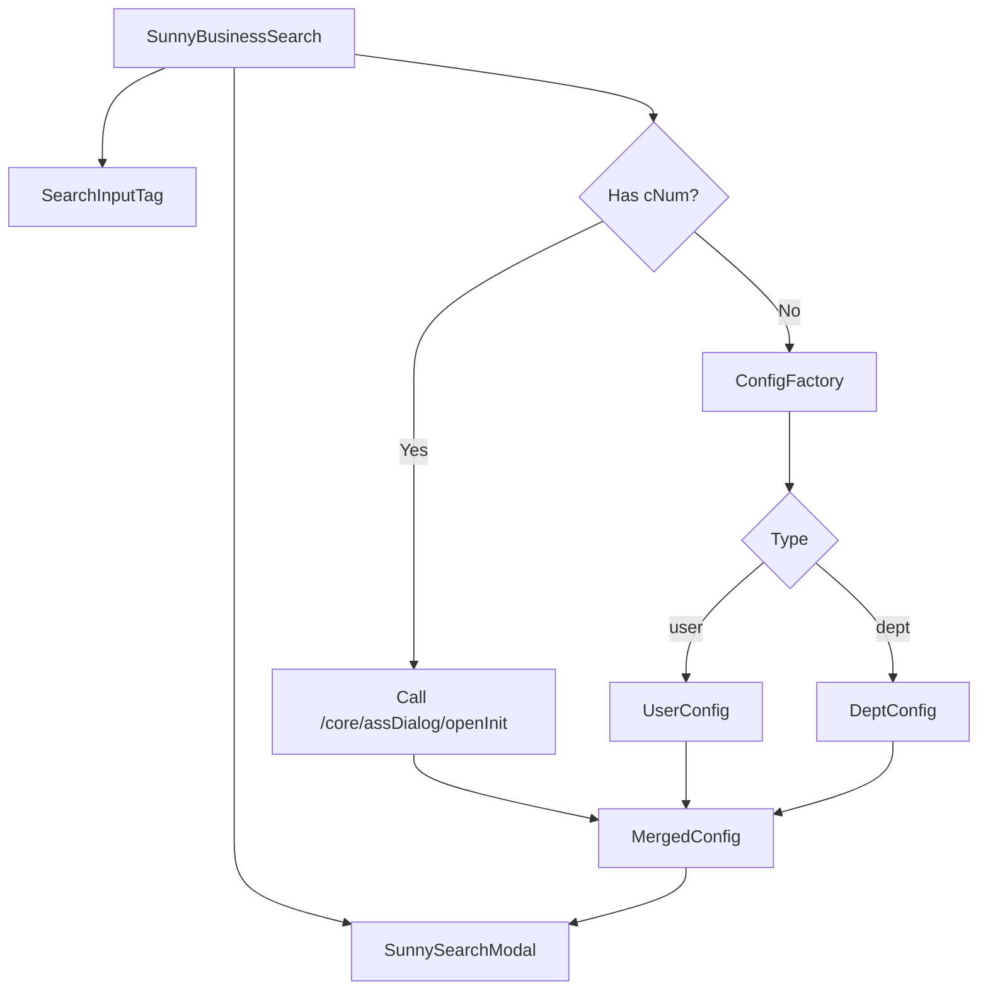

# SunnyBusinessSearch Specification

## 1. Overview (概述)

`SunnyBusinessSearch` 是一个基于 `@ui` 现有组件 (`SearchInputTag` 和 `SunnySearchModal`) 封装的复合业务组件。
它的主要目的是为了简化特定业务实体（如用户、部门、角色等）的选择流程。通过内置预设的搜索配置（表单结构、表格列、API 接口），开发者只需指定 `type` 即可快速使用，无需重复配置复杂的 Modal 参数。

## 2. User Stories (用户故事)

- **开发者**:
  - 我希望通过简单的 `<SunnyBusinessSearch type="user" v-model="users" />` 就能实现一个完整的用户选择器。
  - 我希望通过 `<SunnyBusinessSearch cNum="MACHINE_SBBH" v-model="machines" />` 实现基于后端配置的动态选择器。
  - 我希望组件内部自动处理“点击输入框弹出模态框”、“模态框选择后回填到输入框”的交互逻辑。
  - 我希望能够覆盖部分默认配置（如弹窗标题、宽度），以适应特殊场景。

- **最终用户**:
  - 我看到一个类似标签输入框的控件，显示已选择的业务实体（如“张三”、“技术部”）。
  - 我点击输入框时，弹出一个搜索弹窗，可以进行复杂的条件搜索。
  - 我在弹窗中选择数据后，输入框内自动更新显示的标签。

## 3. Architecture (架构)

该组件采用 **Composite Pattern (组合模式)**，支持 **Static Config (静态配置)** 和 **Dynamic Config (动态配置)** 两种模式：

- **Trigger (触发器)**: 使用 `SearchInputTag` 组件展示已选数据，提供点击交互。
- **Selector (选择器)**: 使用 `SunnySearchModal` 组件提供搜索和选择界面。
- **Configuration Registry (配置注册表)**: 内部维护一个配置映射表，根据 `type` 属性动态加载对应的静态配置。
- **Dynamic Config Loader (动态配置加载器)**: 当提供 `cNum` 时，点击放大镜时调用 `/core/assDialog/openInit` 接口获取动态配置。



## 4. API Specification (接口规范)

### 4.1 Props

| 属性名 | 类型 | 必填 | 默认值 | 说明 |
| :--- | :--- | :--- | :--- | :--- |
| `modelValue` | `any[]` | 是 | `[]` | 双向绑定的选中值 |
| `type` | `string` | 否 | - | 业务类型 (e.g., 'user', 'dept', 'role')，用于加载静态预设配置 |
| `cNum` | `string` | 否 | - | 动态配置编码 (e.g., 'MACHINE_SBBH')，用于从后端加载配置。当提供时，优先使用动态配置流程。 |
| `placeholder` | `string` | 否 | "请选择" | 输入框占位符 |
| `multiple` | `boolean` | 否 | `true` | 是否多选 |
| `maxTagCount` | `number` | 否 | `undefined` | 输入框最大显示标签数 |
| `modalProps` | `Partial<SunnySearchModalProps>` | 否 | `{}` | 透传给 SearchModal 的属性（用于覆盖默认配置） |
| `disabled` | `boolean` | 否 | `false` | 是否禁用 |

### 4.2 Events

| 事件名 | 参数 | 说明 |
| :--- | :--- | :--- |
| `update:modelValue` | `(values: any[])` | 更新绑定值 |
| `change` | `(values: any[])` | 值变化时触发 |

### 4.3 Slots

| 插槽名 | 说明 |
| :--- | :--- |
| `default` | 透传给 SearchInputTag 的内容 |

## 5. Configuration Structure (配置结构)

为了实现业务解耦，我们将定义一个标准的配置接口 `BusinessSearchConfig`：

```typescript
interface BusinessSearchConfig {
  title: string;          // 弹窗标题
  formSchema: FormSchema[]; // 搜索表单配置
  tableColumns: any[];    // 表格列配置
  searchApi: string | Function; // 查询接口
  fieldNames: {           // 字段映射
    label: string;
    value: string;
    desc?: string;
  };
  width?: string | number; // 推荐弹窗宽度
}
```

## 6. Implementation Steps (实现步骤)

1.  **脚手架**: 在 `packages/@ui/src/composite/business-search` 创建组件目录结构。
2.  **核心组件**: 实现 `SunnyBusinessSearch.vue`，完成 UI 组合逻辑。
3.  **配置工厂**: 创建 `configs/index.ts` 及具体的业务配置文件（如 `user.ts`），导出 `getBusinessConfig(type)` 方法。
4.  **动态映射**: 实现 `utils/mapper.ts`，处理后端 `openInit` 接口数据的映射逻辑。
5.  **类型定义**: 在 `types.ts` 中定义组件 Props 和 Config 接口。
6.  **导出**: 在 `packages/@ui/src/composite/index.ts` 中导出新组件。

## 7. Dynamic Config Mapping (动态配置映射)

当组件处于动态配置模式 (`cNum` 存在) 时，需要将后端接口 `/core/assDialog/openInit` 返回的数据映射为 `SunnySearchModal` 可识别的配置。

### 7.1 Response Structure (接口响应结构)

```javascript
{
  cTitle: string; // 弹窗标题
  cWidth: string; // 弹窗宽度
  cHeight: string; // 内容高度
  conditions: [   // 表单配置
    {
      label: "设备编号",
      type: "input", // input | select | date ...
      prop: "C_DEVICE_NO",
      meta: null,
      // ... 其他属性
    }
  ],
  tableCols: [    // 表格列配置
    {
      label: "设备编号",
      prop: "C_DEVICE_NO",
      width: "150"
    }
  ]
}
```

### 7.2 Mapper Logic (映射逻辑)

我们需要实现一个 `mapDynamicConfig` 函数，执行以下转换：

#### 7.2.1 Basic Properties (基础属性)
- `title` = `res.cTitle`
- `width` = `res.cWidth` (需要处理单位，如默认 px)
- `contentHeight` = `res.cHeight`

#### 7.2.2 Form Schema (表单配置)
将 `res.conditions` 映射为 `FormSchema[]`：

| Backend Field | Target Field (FormSchema) | Transformation Logic |
| :--- | :--- | :--- |
| `label` | `label` | 直接映射 |
| `prop` | `fieldName` | 直接映射 |
| `type` | `component` | 映射表: <br> `input` -> `'Input'` <br> `select` -> `'Select'` <br> `date` -> `'DatePicker'` <br> (其他类型需补充) |
| `meta` | `componentProps` | 需要解析 meta 中的特定属性 (如 placeholder, options 等) |

#### 7.2.3 Table Columns (表格配置)
将 `res.tableCols` 映射为 `VxeGridPropTypes.Columns`：

| Backend Field | Target Field (VxeColumn) | Transformation Logic |
| :--- | :--- | :--- |
| `label` | `title` | 直接映射 |
| `prop` | `field` | 直接映射 |
| `width` | `width` | 直接映射 |

### 7.3 Config Merger (配置合并)

最终传递给 `SunnySearchModal` 的配置应为：
```typescript
const modalProps = {
  ...mapDynamicConfig(res),
  ...props.modalProps // 允许用户覆盖动态配置
};
```

## 8. Data Query Mapping (数据查询映射)

当使用动态配置时，`SunnyBusinessSearch` 内部需构建一个代理 `searchApi` 函数，用于适配后端接口 `/core/assDialog/selectForPageCommon`。

### 8.1 Request Mapping (请求映射)

组件内部的 `searchApi` 函数接收 `SunnySearchModal` 传来的参数（`params`），并将其转换为后端需要的格式：

```typescript
const searchApi = async (params: any) => {
  const { pageNo, pageSize, ...conditions } = params;
  
  const payload = {
    pageNo,
    pageSize,
    sqlNum: props.cNum, // 从 Props 获取
    conditions: conditions // 剩余参数作为查询条件
  };
  
  const response = await request.post('/core/assDialog/selectForPageCommon', payload);
  return mapResponse(response);
};
```

### 8.2 Response Mapping (响应映射)

后端返回的 `result` 结构如下：
```javascript
{
  limit: 200,
  offset: 0,
  pages: 1,
  size: 200,
  total: 3,
  records: [
    { C_FACTORY: "1200", C_SITE: "非接触", C_DEVICE_NO: "DE0000110808", ... }
  ]
}
```

`SunnySearchModal` 期望的格式（参考 `use-sunny-search-modal.ts`）：
```typescript
{
  records: any[], // 或 list
  total: number
}
```

由于 `SunnySearchModal` 已经支持 `result.records` 和 `result.total`，因此**无需特殊映射**，直接返回后端响应的 `result` 对象即可。

## 9. Revised Implementation Steps (修订后的实现步骤)

1.  **脚手架**: 在 `packages/@ui/src/composite/business-search` 创建组件目录结构。
2.  **动态映射**: 实现 `utils/mapper.ts`，处理后端 `openInit` (配置) 和 `selectForPageCommon` (数据) 的交互逻辑。
3.  **核心组件**: 实现 `SunnyBusinessSearch.vue`，集成 `SearchInputTag` 和 `SunnySearchModal`，处理动态/静态模式切换。
4.  **配置工厂**: 创建 `configs/index.ts` 及具体的业务配置文件（如 `user.ts`），导出 `getBusinessConfig(type)` 方法。
5.  **类型定义**: 在 `types.ts` 中定义组件 Props 和 Config 接口。
6.  **导出**: 在 `packages/@ui/src/composite/index.ts` 中导出新组件。
